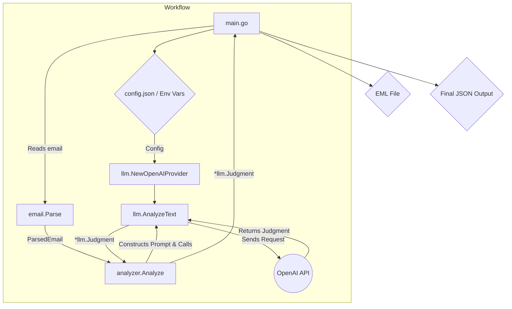

# Development and Design Documentation

This document outlines the internal design, architecture, and development principles of the AI-Powered Suspicious Email Analyzer. It is intended to guide future development and ensure the project remains maintainable and extensible.

## 1. Core Concept and Design Philosophy

The primary goal of this project is to provide a reliable, automated, and structured analysis of emails to identify potential threats like phishing and spam. The core design philosophy revolves around two key principles:

1.  **Structured and Reliable Analysis**: To avoid the inconsistencies of free-form text responses from LLMs, this project leverages **OpenAI's Tool-Calling (Function Calling)** feature. By defining a strict JSON schema for the analysis results (`llm.Judgment`), we compel the LLM to return data in a predictable, machine-readable format. This eliminates the need for fragile regex or string parsing and ensures the output is always consistent.

2.  **Modularity and Testability**: The codebase is organized into distinct packages, each with a clear responsibility. This separation of concerns, combined with a Test-Driven Development (TDD) approach, ensures that each component can be tested independently, leading to a more robust and maintainable system.

## 2. Architecture Overview

The application is divided into the following packages:

-   **`main`**: The entry point of the application. It handles command-line argument parsing, orchestrates the workflow, and prints the final JSON output.
-   **`config`**: Manages application configuration. It loads settings from a JSON file and overrides them with environment variables, providing a flexible setup for different environments.
-   **`email`**: Responsible for parsing raw email content (`.eml` format). It extracts key information such as headers, body text, and URLs.
-   **`llm`**: Acts as a client for the OpenAI-compatible API. It handles the construction of API requests, including the Tool-Call definitions, and parses the structured JSON response from the LLM.
-   **`analyzer`**: The core logic layer. It takes the parsed email data from the `email` package, constructs a detailed prompt, and uses the `llm` package to get a structured analysis (`Judgment`).

### Visual Diagram

## 3. Data Flow

1.  **Initialization**: The `main` function starts, loading configuration from `config.Load()` and initializing the `llm.OpenAIProvider` and `analyzer.EmailAnalyzer`.
2.  **EML Reading**: A single `.eml` file is read.
3.  **Email Parsing**: The raw email message is passed to `email.Parse()`, which returns a `email.ParsedEmail` struct containing the subject, body, URLs, and other relevant headers.
4.  **Prompt Construction**: The `analyzer.Analyze()` method receives the `ParsedEmail` struct and calls `buildPrompt()` to create a detailed, text-based prompt for the LLM.
5.  **LLM Interaction**: `analyzer.Analyze()` calls the `llm.AnalyzeText()` method, passing the prompt and the predefined `report_analysis_result` tool definition.
6.  **API Request**: `llm.AnalyzeText()` sends a request to the OpenAI API, explicitly asking it to use the `report_analysis_result` tool.
7.  **Structured Response**: The LLM processes the prompt and returns a JSON object corresponding to the tool's parameters. This JSON is unmarshalled directly into the `llm.Judgment` struct.
8.  **Aggregation**: The `main` function collects the `MessageID`, `Subject`, and the returned `Judgment` for each email into an `AnalysisResult` struct.
9.  **Final Output**: After all emails are processed, the collected results are marshalled into the final JSON output and printed to standard output.

## 4. Extension Guide

### How to Add a New LLM Provider

To support a different LLM service (e.g., Anthropic, Google Gemini), follow these steps:

1.  **Create a new provider struct** in the `llm` package (e.g., `AnthropicProvider`).
2.  **Implement the `analyzer.LLMProvider` interface** for your new struct. This means creating an `AnalyzeText` method that handles the specific API requirements of the new service.
3.  **Update the `main.go`** file to allow selection of the new provider, perhaps based on a new field in the `config.json`.

### How to Modify the Analysis Criteria

To change the data you want from the LLM (e.g., add a `threat_level` field):

1.  **Update `llm.Judgment`**: Add the new field (e.g., `ThreatLevel string `json:"threat_level"`) to the `llm.Judgment` struct in `llm/llm.go`.
2.  **Update the Tool Definition**: In `analyzer/analyzer.go`, modify the `getAnalysisTool()` function. Add the new field to the `properties` map and, if necessary, to the `required` array.
3.  **Update the Prompt**: In `analyzer/analyzer.go`, adjust the `buildPrompt()` function to instruct the LLM on how to determine the value for the new field.
4.  **Update Tests**: Modify the mock responses and assertions in `analyzer/analyzer_test.go` and `llm/llm_test.go` to reflect the new data structure.
